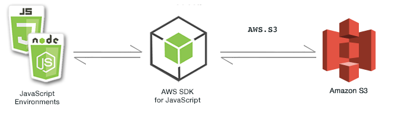

# AWS FILE OPERATIONS

*Programmatically changing the contents of S3 buckets: upload of files, file listing and deletion*

*With:*

* *express*
* *express-handlebars*
* *aws-sdk*

**Plain old project, nothing fancy.**

